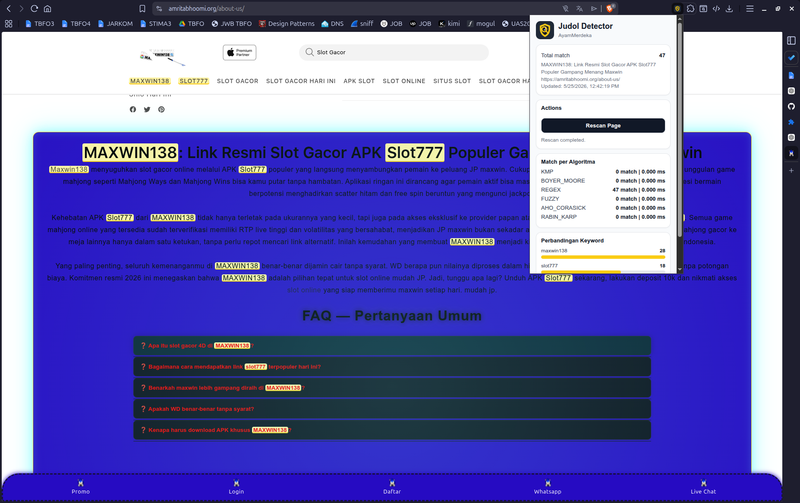

# Judol Detector

> Tugas Besar 3 IF2211 Strategi Algoritma

<p align="center">  </p>

Chromium browser extension untuk mendeteksi teks yang mengandung unsur judi online pada halaman web.

## Fitur

- Membaca keyword dari `public/keywords/keywords.txt`.
- Melakukan scanning teks pada DOM halaman web.
- Mendeteksi pola `<kata><angka>` menggunakan RegEx, contoh `SLOT99`, `MAXWIN138`, `GACOR777`.
- Menyediakan API pemanggilan algoritma KMP, Boyer-Moore, Weighted Levenshtein, Aho-Corasick, dan Rabin-Karp.
- Memberi highlight pada teks yang terdeteksi.
- Menghapus highlight lama saat rescan.
- Menampilkan tooltip pada teks yang terdeteksi.
- Menampilkan statistik deteksi melalui popup extension.
- Menyediakan tombol `Rescan Page` dari popup.

## Algoritma

### Knuth-Morris-Pratt

KMP adalah algoritma pencocokan string yang menggunakan tabel prefix/failure function agar pencarian tidak mengulang perbandingan karakter dari awal setiap terjadi mismatch.

Pada project ini, KMP digunakan untuk exact matching keyword dari `keywords.txt`.

### Boyer-Moore

Boyer-Moore adalah algoritma pencocokan string yang mencocokkan pattern dari kanan ke kiri dan menggunakan tabel last occurrence untuk menentukan pergeseran pattern saat mismatch.

Pada project ini, Boyer-Moore digunakan untuk exact matching keyword dari `keywords.txt`.

### Regular Expression

RegEx digunakan untuk mendeteksi pola `<kata><angka>`, terutama kata yang diikuti 2 sampai 3 digit angka.

Contoh:

```txt
SLOT99
MAXWIN138
GACOR777
```

### Weighted Levenshtein Distance

Weighted Levenshtein Distance digunakan untuk fuzzy matching terhadap keyword yang dimodifikasi dengan karakter mirip secara visual, misalnya `O` menjadi `0`, `A` menjadi `4`, atau `I` menjadi `1`.

### Algoritma Bonus

Project juga disiapkan untuk algoritma bonus:

- Aho-Corasick
- Rabin-Karp

## Struktur Project

```txt
Tubes3_AyamMerdeka/
├── dist/
├── doc/
├── public/
│   ├── keywords/
│   │   └── keywords.txt
│   ├── manifest.json
│   ├── popup.html
│   └── styles/
├── src/
│   ├── algorithms/
│   ├── content/
│   ├── popup/
│   └── shared/
├── tests/
│   └── pages/
├── package.json
├── tsconfig.json
├── vite.config.ts
└── README.md
```

## Requirement

- Node.js
- npm
- Chromium-based browser, misalnya Google Chrome, Chromium, Brave, atau Microsoft Edge

## Instalasi

```bash
npm install
```

## Build

Cek TypeScript:

```bash
npm run check
```

Build extension:

```bash
npm run build
```

Hasil build akan berada di folder:

```txt
dist/
```

## Cara Load Extension

1. Jalankan `npm run build`.
2. Buka halaman extension browser:
   - Chrome/Chromium: `chrome://extensions/`
   - Brave: `brave://extensions/`
3. Aktifkan `Developer mode`.
4. Klik `Load unpacked`.
5. Pilih folder `dist/`.

## Cara Penggunaan

1. Buka halaman web yang ingin diperiksa.
2. Extension akan melakukan scan awal.
3. Teks yang terdeteksi akan diberi highlight.
4. Hover pada highlight untuk melihat tooltip.
5. Buka popup extension untuk melihat statistik.
6. Klik `Rescan Page` untuk scan ulang halaman aktif.

## Keyword

Keyword disimpan pada:

```txt
public/keywords/keywords.txt
```

Format:

```txt
slot
gacor
maxwin
hoki
casino
judol
```

Setiap keyword dipisahkan dengan baris baru.

## Testing

Jalankan local server dari root project:

```bash
python3 -m http.server 5500
```

Buka halaman test:

```txt
http://localhost:5500/tests/pages/basic.html
http://localhost:5500/tests/pages/dom-runtime.html
http://localhost:5500/tests/pages/no-match.html
http://localhost:5500/tests/pages/multiple-matches.html
http://localhost:5500/tests/pages/ignored-elements.html
http://localhost:5500/tests/pages/rescan.html
http://localhost:5500/tests/pages/layout-safety.html
```

## Author

Kelompok: AyamMerdeka

- 13524051 Mikhael Andrian Yonatan
- 13524053 Muhammad Haris Putra Sulastianto
- 13524105 Nicholas Luis Chandra

Teknik Informatika, Institut Teknologi Bandung — 2026

<!-- | Nama                             | NIM      | Tugas                           |
| -------------------------------- | -------- | ------------------------------- |
| Mikhael Andrian Yonatan          | 13524051 | Algorithm, Censor, OCR          |
| Muhammad Haris Putra Sulastianto | 13524053 | DOM & Extension, Popup, Tooltip |
| Nicholas Luis Chandra            | 13524105 | Algorithm                       | -->
